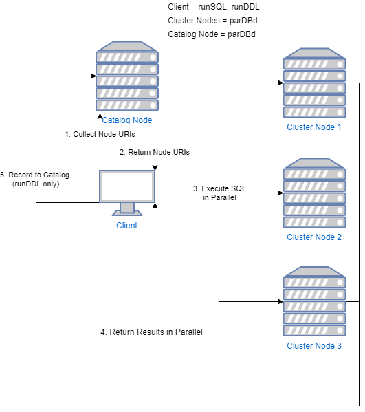

# Naive SQL Processing for Parallel DBMS
## Overview

This repository contains code to execute a SQLite statement

## Getting Started

## Usage

## Protocol Design
This repository holds the components fir

## Troubleshooting
### parDBd.py Errors
Error Code | Message | Fix |
--- | --- | ---
2 | `Usage: python3 parDBd.py [hostname] [port]` | An incorrect number of arguments was supplied. There must exist exactly two arguments to this program.
3 | `Socket Error: [Errno 11001] getaddrinfo failed.` | Using the supplied hostname, a socket was unable to be binded. Double check your hostname.
3 | `Socket Error: [Errno 98] Address is already in use.` | The specified port is already in use. Use another port.

### runDDL.py Errors
Error Code | Message | Fix
--- | --- | ---
2 | `Usage: python3 runDDL.py [clustercfg] [ddlfile]` | An incorrect number of arguments was supplied. There must exist exactly two arguments to this program.
3 | `Error: [Errno 2] No such file or directory: '...'` | The supplied `clustercfg` file cannot be found. Double check the path.
4 | `Error: [Errno 2] No such file or directory: '...'` | The supplied `ddlfile` file cannot be found. Double check the path.
4 | `Error: No terminating semicolon.` | The supplied `ddlfile` does not have a terminating semi-colon to mark the end of the statement.
5 | `Error: Cannot connect to the catalog. No statement executed.` | The catalog node could not be reached. Check your internet connection, the `catalog.hostname` entry in the `clustercfg` file, and make sure that the daemon is running on the catalog node.
6 | `Error: Node entries not formatted correctly.` | The node entries in the `clustercfg` file are not formatted correctly. Check the format in the `runDDL` section.
7 | `Catalog Error: Socket could not be established.` | Double check your internet connection. Somewhere between the executing and logging process, a connection to the catalog node was no longer able to be established.

### runSQL.py Errors
Error Code | Message | Fix
--- | --- | ---
2 | `Usage: python3 runSQL.py [clustercfg] [sqlfile]` | An incorrect number of arguments was supplied. There must exist exactly two arguments to this program.
3 | `Error: [Errno 2] No such file or directory: '...'` | The supplied `clustercfg` file cannot be found. Double check the path.
4 | `Error: [Errno 2] No such file or directory: '...'` | The supplied `sqlfile` file cannot be found. Double check the path.
4 | `Error: No terminating semicolon.` | The supplied `sqlfile` does not have a terminating semi-colon to mark the end of the statement.
5 | `Catalog Error: Socket could not be established.` | The catalog could not be reached. Check your internet connection, the `catalog.hostname` entry in the `clustercfg` file, and make sure that the daemon is running on the catalog node.
5 | `Catalog Error: Table ... not found.` | The table specified in the `sqlfile` was not found on the catalog. Execute a 'CREATE TABLE' statement instead with the `clustercfg` configuration specifications, or fix the table name.
6 | `Error: Table could not be found in 'sqlfile'.` | A table name could not be parsed from the given `sqlfile`. Double check your SQLite syntax here.

### loadCSV.py Errors
Error Code | Message | Fix
--- | --- | ---
2 | `Usage: python3 loadCSV.py [clustercfg] [csv]` | An incorrect number of arguments was supplied. There must exist exactly two arguments to this program.