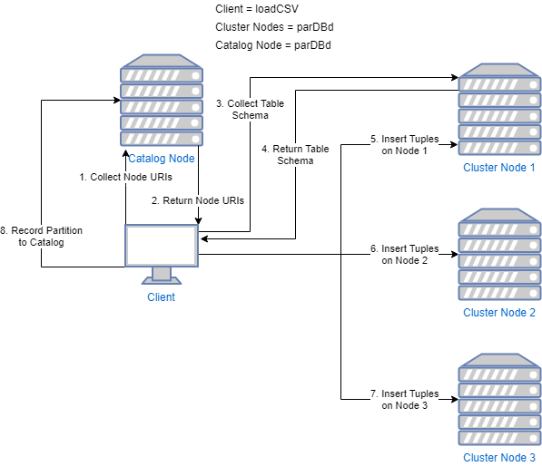

# Naive SQL Processing for Parallel DBMS
## Overview

**GitHub Repository located here:** https://github.com/glennga/sql-process

This repository contains code to execute a SQLite statement on every node in a cluster, and to load data from a CSV into the cluster using different partitioning methods.

The node that initiates these operations is known as the *client* node. This client node can exist as a part of the cluster, or completely separate from the cluster. The nodes that hold the data (in databases) will be referred to as *server* nodes. There exists a special server node that holds information about how to reach each node in the cluster and metadata about the cluster itself (partitions, number of nodes, etc...). This node is known as the *catalog* node.

For client programs that execute a single statement on several machines (i.e. `runDDL.py`, `runSQL.py`), the following occurs:


For client programs that load a CSV file onto several machines using a specified partitioned, the following occurs:



## Getting Started
1. To get started, all nodes in your cluster should have `python3` and `git`. To access your data outside of Python, install `sqlite3` as well:
    ```
    apt-get install -y python3 python3-pip git sqlite3
    ```
2. Install `antlr4` and `configparser` for Python.
    ```
    pip3 install antlr4-python3-runtime
    pip3 install configparser
    ```
2. With all of these installed, clone this repository onto your client and every node in your cluster.
    ```
    git clone https://github.com/glennga/sql-process.git
    ```
3. The client node is the node that will perform some operation on the cluster of nodes. Every client node must contain a `clustercfg` file which holds some description of the cluster. *This file will vary depending on which client program you want to call.* More specifications on this format is specified in the **Format of File: clustercfg** section below.

    An example `clustercfg` is depicted to create a table across all nodes of a three-node system (`runDDL.py`):
    ```
    catalog.hostname=10.0.0.3:50001/cat.db

    numnodes=3
    node1.hostname=10.0.0.3:50001/node1.db
    node2.hostname=10.0.0.3:50002/node2.db
    node2.hostname=10.0.0.3:50003/node3.db
    ```

    Another example is depicted to load a CSV file onto the cluster (`loadCSV.py`) using hash partitioning on a three-node system:
    ```
    catalog.hostname=10.0.0.3:50001/mycatdb

    tablename=BOOKS

    partition.method=hash
    partition.column=isbn
    partition.param1=3
    ```

    Another example file for executing SQL on the cluster (`runSQL.py`) is depicted below:
    ```
    catalog.hostname=10.0.0.3:50001/cat.db
    ```
4. Create the desired second argument file, which must also be stored on your client node. *This file also varies for each client program.* More specifications can be found in the **Format of File: csv** and **Format of File: sqlfile (or ddlfile)**  sections below.

    An example of a DDL file is depicted below (`runDDL.py`):
    ```
    CREATE TABLE BOOKS(isbn char(14), title char(80), price
    decimal);
    ```

    An example of a SQL file is depicted below (`runSQL.py`):
    ```
    SELECT * FROM BOOKS;
    ```

    An example of a CSV file is depicted below (`loadCSV.py`):
    ```
    123323232,Database Systems,Ramakrishnan,Raghu
    234323423,Operating Systems,Silberstein,Adam
    ```

5. For each node in your cluster, navigate to this repository and start the server daemon. Specify the hostname in the first argument, and the port number in the second:
    ```
    python3 parDBd.py [hostname] [port]
    ```

6. For an empty cluster, you must use `runDDL.py` to create the desired table to operate on. Specify the `runDDL.py` `clustercfg` file in the first argument, and the `ddlfile` in the second:
    ```
    python3 runDDL.py [clustercfg] [ddlfile]
    ```

    If this is successful, you should see some variant of the output below:
    ```
    Successful Execution on Node: 2
    Successful Execution on Node: 1
    Successful Execution on Node: 3
    Catalog Node Update Successful.
    ```

7. With a table defined, the next operation that normally follows is the insertion of data. Use `loadCSV.py` to load data onto a partitioned cluster. Specify the `loadCSV.py` `clustercfg` file in the first argument, and the `csv` in the second:
    ```
    python3 loadCSV.py [clustercfg] [csv]
    ```

    If this is successful, you should see the output below:
    ```
    Insertion was successful.
    Catalog node has been updated with the partitions.
    ```

8. To view the data you just inserted, use `runSQL.py` with a `SELECT` statement as the `sqlfile`. Specify the `runSQL.py` `clustercfg` file in the first argument, and the `sqlfile` in the second:
    ```
    python3 runSQL.py [clustercfg] [sqlfile]
    ```

    If this is successful, you should see some variant of the output below:
    ```
    Node 1: No tuples found.
    Node 2: No tuples found.
    Node 3: [123323232, Database Systems, Ramakrishnan,Raghu, ]
    Node 3: [234323423, Operating Systems, Silberstein, Adam, ]

    Summary:
    Node 1[10.0.0.3:50001/node1.db]: Successful
    Node 2[10.0.0.3:50002/node2.db]: Successful
    Node 3[10.0.0.3:50003/node3.db]: Successful
    ```

## Usage
### Format of File: clustercfg
The `clustercfg` file holds information about the cluster required to perform the desired operation. For each `clustercfg` file:

1. Each entry must be formatted as a `<key>=<value>` pair. There must exist no spaces between the `=` character for the key and the value.
2. The key `catalog.hostname` must exist.

Every catalog node entry must be formatted as such:
```
catalog.hostname=[catalog-hostname]:[catalog-port]/[catalog-database-file]
```
1. There must exist a colon character separating the hostname and the port, with no spaces between the two.
2. There must exist a forward slash character separating the port and the database file, with no spaces between the two.

The specifics for each `clustercfg` file are listed below. The `Key Format` and `Value Format` are specified like `<key>=<format>` in `clustercfg`:

Client Program | Key Format | Value Format | Description
--- | ---  | --- | ---
`runDDL.py` | `numnodes` | `[number of nodes]` |Specifies the number of nodes in the cluster.
`runDDL.py` | `node[node-id].hostname` | `[node hostname]:[node port]/[database file]` | Specifies the URIs of each node in the cluster. See special instructions below.
`loadCSV.py` | `tablename` | `[name of table]` | Specifies the table that exists in the cluster (logged in the catalog node) to insert the data to.
`loadCSV.py` | `partition.method` | `[hash, range, notpartition]` | Specifies the partition method used to insert the data with. **This must be in the space [hash, range, notpartition]**.
`loadCSV.py` (hash or range partitioning) | `partition.column` | `[column in table]` | Specifies the column to use with the partition. This **must** be a numeric column.
`loadCSV.py` (hash partitioning) | `partition.param1` | `[number of nodes in cluster]` | Specifies the number of nodes in the cluster. The hash function (simple mod-based hashing) used corresponds to this number.
`loadCSV.py` (range partitioning) | `numnodes` | `[number of nodes]` | Specifies the number of nodes in the cluster.
`loadCSV.py` (range partitioning) | `partition.node[node-id].param1` | `[floor of specific column]` | Species the minimum value of the specified column that this node will store. A value of `-inf` can be used to represent a limitless lower bound. See special instructions below. This **must** be less than the corresponding `param2`.
`loadCSV.py` (range partitioning) | `partition.node[node-id].param2` | `[ceiling of specific column]` | Species the maximum value of the specified column that this node will store. A value of `+inf` can be used to represent a limitless upper bound. See special instructions below. This **must** be greater than the corresponding `param1`.

For all `node[node-id]` and `partition.node[node-id].param[1/2]` entries:
1. Node-IDs are 1-indexed. The first node must start at 1, and the last node must end at `N = numnodes`.
2. There must exist no gaps between the indexing of nodes IDs (e.g. no `node1`, `node2`, `node5`, `node6`).
3. There must exist a colon character separating the hostname and the port, with no spaces between the two.
4. There must exist a forward slash character separating the port and the database file, with no spaces between the two.

### Format of File: csv
The `csv` file holds a list of tuples to insert into your cluster.

1. Tuples must be normalized (of the same length, no missing entries).
2. Tuple fields must be separated by commas.
3. Tuples themselves must be separated by newlines.
4. The number of fields for a given tuple must match the number of fields in the specified table.

### Format of File: sqlfile (or ddlfile)
The SQL file holds a single SQLite statement to execute on all nodes in the cluster.

1. This statement must be written in SQLite 3.
2. This statement must be terminated with a semicolon.
3. There must only exist one statement. If there exists multiple statements in this file, then only the first will be executed.
4. This statement must deal with some table.

### Client Program: runDDL.py
The `runDDL.py` file holds the code to create a table across all nodes in the catalog, and to setup the required metadata in the catalog node. The arguments to this script are the cluster configuration file and the DDL statement to execute:
```
python3 runDDL.py [clustercfg] [ddlfile]
```

Using the given arguments, the following occurs:
1. Collect the catalog URI from the `clustercfg` file. Collect the DDL statement from the `ddlfile`. If this cannot be performed, the program exits with an error.
2. Test the connection to the catalog node. This is meant to prioritize the logging of the metadata over executing statements without any history. If this is not successful, then an error is returned to the console and the program exits.
3. Collect the node URIs from the `clustercfg` file. If an error exists with the node formatting here, the program exits with an error.
4. If a connection to the catalog is able to be established, then the an execution command list is sent. This occurs in parallel, and spawns `N = numnodes` threads.
    1. For each thread (node), an attempt to connect to a socket is made. If this is not successful, then an error message is printed to the console and the routine exits here.
    2. If the connection is successful, then the execution command list (specified in the **Protocol Design** section) is pickled and sent over the socket.
    3. A response command list from the daemon is waited for. If there exists no response, then an error is printed to the console and the routine exits here.
    4. If the response string from the command list is not `Success`, then the returned error message is displayed to the console and the routine exits here.
    5. Otherwise, a success message is printed to the console. The success is recorded in a list (denoted as `successful_nodes` here), and the connection to the daemon is closed.
4. Once all threads are done executing, log all successful execution commands from the `successful_nodes` list. If this is not successful, print an error message to the console and the program exits.

### Client Program: runSQL.py
The `runSQL.py` file holds the code to execute a general SQLite statement across all nodes in the cluster. If a DDL statement is passed here, then the program `runDDL.py` is forked and used instead. If forked, the `clustercfg` for the `runDDL.py` must be used in place of the `runSQL.py` `clustercfg`.
```
python3 runSQL.py [clustercfg] [sqlfile]
```

Using the given arguments, the following occurs:
1. Collect the catalog URI from the `clustercfg` file. Collect the SQL statement from the `sqlfile`. If this cannot be performed, the program exits with an error.
2. If the SQL statement is found to be a `CREATE TABLE` or `DROP TABLE` statement (i.e. a DDL), then `runDDL.py` is forked with the arguments presented here.
3. Test the connection to the catalog node. If this is not successful, then an error is returned to the console and the program exits.
4. Collect the node URIs from the catalog node. If this is not successful, the an error is returned to the console and the program exits.
5. The table name is parsed from the SQL statement. If this is an improperly formatted SQLite statement, then an error is returned to the console and the program exits.
6. Create the shared memory segment for all nodes to record to. As opposed to `runDDL.py`, this script implements concurrency with the `multiprocessing` library as opposed to the `threading` library.
7. Send the execution command list. This occurs in parallel, and creates `N = |Node URIs|` processes.
    1. For each process (node), an attempt to connect to the socket is made. If this is not successful, then an error message is printed to the console and the routine exits here.
    2. If the connection is successful, then the excitation command list is pickled and sent over the socket.
    3. A response command list from the daemon is waited for. If there exists no response or an string is returned from the socket, then an error is printed to the console and the routine exits here.
    4. If the response command list is valid, then return any results from the socket. Listen and repeat until the terminating command string is sent.
    5. Record the successful operation in the shared memory segment, and close the connection to the daemon.
8. Once all processes are done executing, print a summary block that informs the client of the end state of all processes (i.e. failed or succeeded).

### Client Program: loadCSV.py
The `loadCSV.py` file holds the code to load a comma-separated-file of tuples to a cluster of nodes. The location of each tuple is determined by the partitioning specified in the cluster configuration file. The arguments to this script are the cluster configuration file and the CSV of the tuples.
```
python3 loadCSV.py [clustercfg] [csv]
```

Using the given arguments, the following occurs:
1. Collect the catalog URI, and the partitioning information from the `clustercfg` file. If the `clustercfg` file is not properly formatted, the program exits with an error.
2. Collect the node URIs from the catalog node. If this is not successful, then an error is returned to the console and the program exits.
3. Verify the partitioning parameters collected with the number of node URIs retrieved. For hash partitioning, this means that `partition.param1 = |node URIs|`. For range partitioning, this means that `numnodes = |node URIs|`.
4. Collect the columns from the first node in the node URIs list. If this is not successful, then an error is printed to the console and the program exits with an error.
5. Connect to all nodes in the cluster. If any of these cannot be reached, then an error is printed to the console and the program exits with an error. It wouldn't be ideal to only insert some of the data.
6. Execute the appropriate insertion based on the specified `partition.method` parameter.
    - If `nopartition` is specified, then the insertion is performed across all nodes. A SQL statement is prepared and sent over the socket with the rows to insert *all at once*. This operation is performed for each node, serially (starting at node 1, ending at node N).
    - If `hash` is specified, then a tuple is assigned to a node using the simple hash function: `H(X) = (column mod partition.param1) + 1`. The value for `column` is found by determining the index of the specified `partition.column` for a given line in the CSV. The SQL statement is prepared appropriately and stored in memory. Once all statements are constructed, the appropriate SQL and parameters are sent to each appropriate socket, serially (starting at node 1, ending at node N).
    - If `range` is specified, then a tuple is assigned to a node using the ranges specified with `partition.node[node-id].param[1 or 2]`. `param1` indicates the lower bound that `column` must meet for a given node, and `param2` indicates the upper bound. If any of these bounds overlap, then the node with the lower number is chosen. The value for `column` is found by determining the index of the specified `partition.column` for a given line in the CSV. The SQL statement is prepared appropriately and stored in memory. Once all statements are constructed, the appropriate SQL and parameters are sent to each appropriate socket, serially (starting at node 1, ending at node N).
    - If there are any errors in the processes, print an error to the console and continue the insertion early. The reasoning behind continuing the insertion is to assume that the entire cluster is mostly operational. The user must handle each node that an error has occurred on manually.
7. If the insertion is successful, print a success message to the console.

### Server Program: parDBd.py
The `parDBd.py` file holds the code to be run on all nodes in the cluster. This is the server daemon. The arguments to this script are the hostname and the port:
```
python3 parDBd.py [hostname] [port]
```

Using the specified arguments, the daemon listens on a given port. Once a connection is made, the following happens:
1. Retrieve the response. This is referred to as the _command list_.
2. Try to 'unpickle' (deserialize) the command list. If this cannot occur, an error is returned through the socket and the connection is closed.
3. If the command list is able to be unpickled, check if the command list can be iterated over. If not, then the format of the command list is wrong. An error is returned through the socket and the connection is closed. The format command to the daemon must be specified in the **Protocol Design** section (before serialization).
4. Perform the desired operation based on the first element in the command list, or the _operation code_. If an error occurs during this process, return the error as a string. Otherwise, return a different command list containing the response operation code and the desired information.
5. The current connection is closed, and we listen on the same port for another connection.

## Protocol Design
The general design of the communication between the server daemon and the client is as follows:
1. Client sends a list, whose first element is the operation code and where all following elements are pieces of data required to perform the operation.
2. Server daemon receives the list, and performs the operation based on the given operation code.
3. To return a message, the server daemon returns a list containing the returned operation code and the success message or any other data as the following elements. If an error is received, then a string containing the error is sent instead of a list.
4. The client receives the data from the server. If a string is returned, then an error has occurred and the client handles this appropriately. Otherwise, continue with the given data.

The specific operation codes are listed below:

Desired Operation | Operation Code | Client Sends... | Server Returns...
--- | --- | --- | ---
**Client** wants to perform an operation. **Server** wants to inform the client that an error has occured. | --- | --- | `string-containing-the-error`
--- | --- | --- | ---
**Client** wants to execute a non-select SQLite statement on a remote node. **Server** wants to inform client that the operation was successful. | `E` | `['E', database-file-name, sql-to-execute]` | `['EZ', 'Success']`
**Client** wants to execute a select SQLite statement on a remote node. **Server** wants to deliver tuples to client, and inform the client that more tuples are on the way. | `E` | `['E', database-file-name, sql-to-execute]` | `['ES', tuple-to-send]`
**Client** wants to execute a select SQLite statement on a remote node. **Server** wants to deliver tuples to client, and inform this the last tuple it will send. | `E` | `['E', database-file-name, sql-to-execute]` | `['EZ', last-tuple-to-send]`
**Client** wants to record a table creation or destroying SQLite statement on the catalog node. **Server** (i.e. the catalog node) wants to inform the client that this operation was successful. | `C` | `['C', database-catalog-file-name, list-of-node-uris, ddl-to-execute]` | `['EC', 'Success']`
**Client** wants to record the type of partitioning used on the catalog node. **Server** (i.e. the catalog node) wants to inform the client that his operation was successful.| `K` | `['K', database-catalog-file-name, dictionary-describing-partition, number-of-nodes-in-cluster]` | `['EK', 'Success']`
**Client** is requesting the node URIs of a specific table from the catalog node. **Server** (i.e. the catalog node) wants to deliver these node URIs to the client. | `U` | `['U', database-catalog-file-name, name-of-table]` | `['EU', list-of-node-uris]`
**Client** is requesting the columns of a specific table from some node in the cluster (it is assumed that all nodes have the same tables). **Server** wants to deliver these columns to the client. | `P` | `['P', database-file-name, table-name]` | `['EP', list-of-columns-in-table]`

## Troubleshooting
### parDBd.py Errors
Error Code | Message | Fix |
--- | --- | ---
2 | `Usage: python3 parDBd.py [hostname] [port]` | An incorrect number of arguments was supplied. There must exist exactly two arguments to this program.
3 | `Socket Error: [Errno 11001] getaddrinfo failed.` | Using the supplied hostname, a socket was unable to be binded. Double check your hostname.
3 | `Socket Error: [Errno 98] Address is already in use.` | The specified port is already in use. Use another port.

### runDDL.py Errors
Error Code | Message | Fix
--- | --- | ---
2 | `Usage: python3 runDDL.py [clustercfg] [ddlfile]` | An incorrect number of arguments was supplied. There must exist exactly two arguments to this program.
3 | `Error: [Errno 2] No such file or directory: '...'` | The supplied `clustercfg` file cannot be found. Double check the path.
4 | `Error: [Errno 2] No such file or directory: '...'` | The supplied `ddlfile` file cannot be found. Double check the path.
4 | `Error: No terminating semicolon.` | The supplied `ddlfile` does not have a terminating semi-colon to mark the end of the statement.
5 | `Error: Cannot connect to the catalog. No statement executed.` | The catalog node could not be reached. Check your internet connection, the `catalog.hostname` entry in the `clustercfg` file, and make sure that the daemon is running on the catalog node.
6 | `Error: Node entries not formatted correctly.` | The node entries in the `clustercfg` file are not formatted correctly. Check the format in the `runDDL` section.
7 | `Catalog Error: Socket could not be established.` | Double check your internet connection. Somewhere between the executing and logging process, a connection to the catalog node was no longer able to be established.

### runSQL.py Errors
Error Code | Message | Fix
--- | --- | ---
2 | `Usage: python3 runSQL.py [clustercfg] [sqlfile]` | An incorrect number of arguments was supplied. There must exist exactly two arguments to this program.
3 | `Error: [Errno 2] No such file or directory: '...'` | The supplied `clustercfg` file cannot be found. Double check the path.
4 | `Error: [Errno 2] No such file or directory: '...'` | The supplied `sqlfile` file cannot be found. Double check the path.
4 | `Error: No terminating semicolon.` | The supplied `sqlfile` does not have a terminating semi-colon to mark the end of the statement.
5 | `Catalog Error: Socket could not be established.` | The catalog could not be reached. Check your internet connection, the `catalog.hostname` entry in the `clustercfg` file, and make sure that the daemon is running on the catalog node.
5 | `Catalog Error: Table ... not found.` | The table specified in the `sqlfile` was not found on the catalog. Execute a 'CREATE TABLE' statement instead with the `clustercfg` configuration specifications, or fix the table name.
6 | `Error: Table could not be found in 'sqlfile'.` | A table name could not be parsed from the given `sqlfile`. Double check your SQLite syntax here.


### loadCSV.py Errors
Error Code | Message | Fix
--- | --- | ---
2 | `Usage: python3 loadCSV.py [clustercfg] [csv]` | An incorrect number of arguments was supplied. There must exist exactly two arguments to this program.
3 |`Error: Not found: '...'` | There exists a key error in the `clustercfg` file. Double check the `clustercfg` configuration specifications.
4 | `Incorrect number of nodes specified in 'clustercfg'.` | If hash partitioning is specified, then the number of nodes in the cluster do not match the `partition.param1` in `clustercfg`. If range partitioning is specified, then the number of nodes in the cluster do match the `numnodes` in `clustercfg`. Use `runDDL.py` to change the table schema, or correct your `clustercfg` file.
5 | `Catalog Error: Socket could not be established.` | The catalog could not be reached. Check your internet connection, the `catalog.hostname` entry in the `clustercfg` file, and make sure that the daemon is running on the catalog node.
6 | `Could not connect to first node in the cluster.` | The first node in the cluster could not be reached. Ensure that the daemon is running on all  nodes in the cluster.
7 | `All nodes in cluster could not be reached.` | There exists a node in the cluter that could not be reached. Ensure that the daemon is running on all nodes in the cluster.

